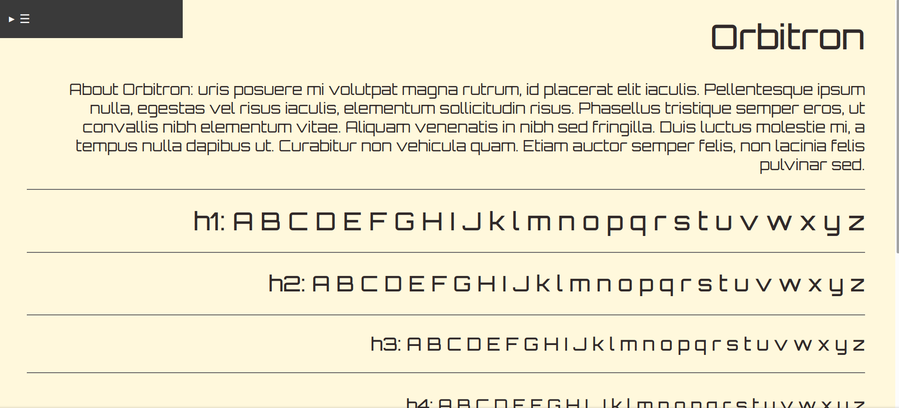

# FontsPanel

Small React app showcasing fonts I commonly use

## How to use:

1. Clone repo into desired directory `git clone https://github.com/Toughee/FontsPanel.git` or `gh repo clone Toughee/FontsPanel`
2. Run `npm install` in your terminal to install all app node modules, yarn packages and dependencies
3. Run `yarn start` in your terminal to run app on http://localhost:3000/

## Testing tools used for app:

-   React Testing library and Jest for testing components
-   TravisCI and CircleCI for CI/CD development
-   Prettier for keeping all code formatted and organized

### Completed app tasks:

- [x] Include CircleCI and Travis-CI inside project
- [x] Improve U.I. design for app
- [x] Add testing scripts for each component
### Future app goals:

- [ ] Improve current testing scripts inside app 